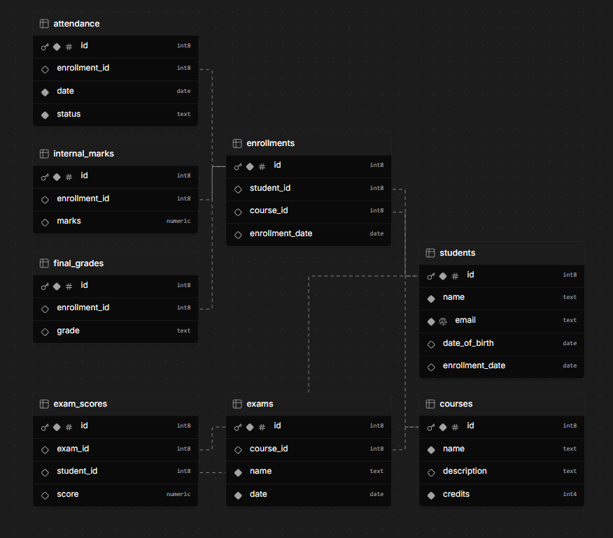

# 🎓 Student Management Database Schema

This repository includes a fully modular, professional **PostgreSQL** schema for managing a **university/college academic database**, extended with triggers, views, audit logging, and more.

---

## 📌 Features

- ✅ Modularized SQL schema for clarity and maintainability  
- 🔗 Referential integrity using `FOREIGN KEY` constraints  
- 🔍 Input validation with `CHECK` constraints  
- 🐘 Designed for PostgreSQL (portable to other RDBMS)  
- 🎯 Triggers to auto-assign grades  
- 👓 Views for student-course summaries and attendance analytics  
- 🕵️‍♂️ Audit logging framework for changes  
- 🧠 `pgvector` support for AI-based semantic search  

---

## 📁 Folder Structure

```
schema/
├── 01_create_students.sql
├── 02_create_courses.sql
├── 03_create_enrollments.sql
├── 04_create_attendance.sql
├── 05_create_exams.sql
├── 06_create_exam_scores.sql
├── 07_create_internal_marks.sql
├── 08_create_final_grades.sql
├── 09_create_views.sql
├── 10_triggers.sql
└── 11_audit_log.sql
```

---

## 🚀 Getting Started

To run the project locally on PostgreSQL:

```sql
\i schema/01_create_students.sql
\i schema/02_create_courses.sql
...
\i schema/11_audit_log.sql
```

---

## 🧑‍💻 Who Can Use This Repo?

This project is ideal for:

- 🎓 **Students** learning SQL, DBMS, and data modeling  
- 🏫 **Educational institutions** simulating academic data  
- 👨‍💻 **Developers** building LMS/ERP systems  
- 📊 **Data analysts** building dashboards on student data  
- 🧑‍🏫 **Instructors** teaching relational databases with hands-on demos  

---

## 📊 Entity-Relationship Diagram

This ER diagram shows the relationships among Students, Courses, Exams, Attendance, and Grades.



---

## 📜 License

Licensed under the **MIT License**. Feel free to fork and enhance!

---

## 💬 Feedback & Contributions

Pull requests are welcome. For major changes, please open an issue first to discuss what you would like to change.
